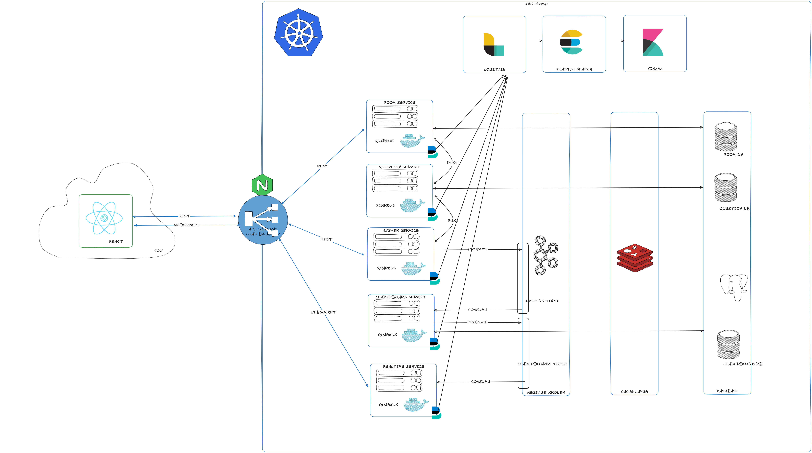
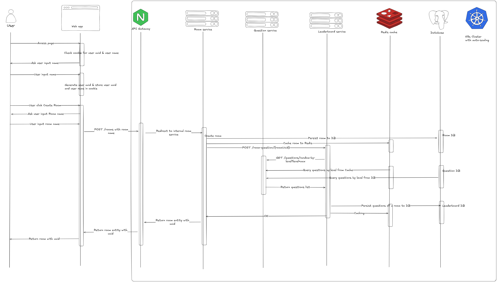
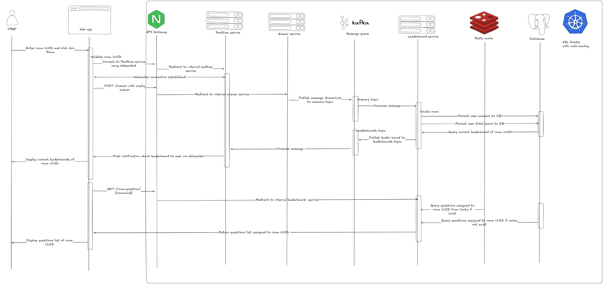
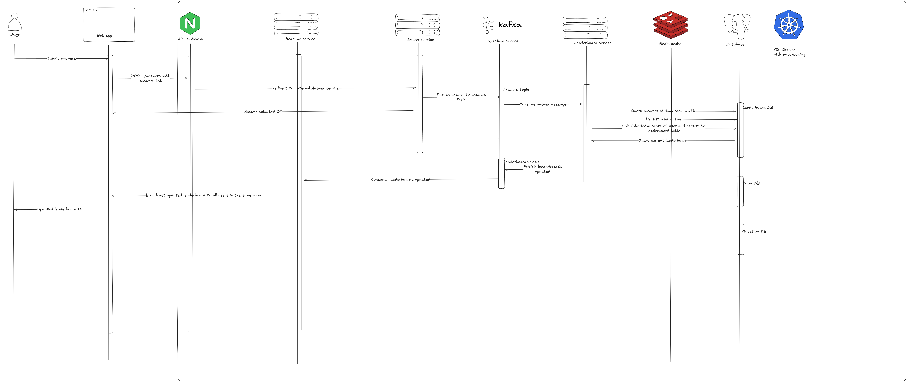

# Real-Time Vocabulary Quiz Coding Challenge

## Overview

Welcome to the Real-Time Quiz coding challenge! Your task is to create a technical solution for a real-time quiz feature for an English learning application. This feature will allow users to answer questions in real-time, compete with others, and see their scores updated live on a leaderboard.

## Acceptance Criteria

1. **User Participation**:
   - Users should be able to join a quiz session using a unique quiz ID.
   - The system should support multiple users joining the same quiz session simultaneously.

2. **Real-Time Score Updates**:
   - As users submit answers, their scores should be updated in real-time.
   - The scoring system must be accurate and consistent.

3. **Real-Time Leaderboard**:
   - A leaderboard should display the current standings of all participants.
   - The leaderboard should update promptly as scores change.

## Challenge Requirements

### Part 1: System Design

1. **System Design Document**:
   - **Architecture Diagram**: 
   

   - **Component Description**: 
      - #### Frontend web app: display UI to user.      
      - #### Backend deployed in k8s Cluster: orchestrate service instances by k8s.
      - #### API Gateway & Ingress deployed in K8s
      - #### Logging, monitoring and visualize by ELK stack
      - #### Micro-services as containers support scalable and separate of concern, using database per service pattern.
         - Room service: for room creation, room joining
         - Question service: for storing and fetching questions only. Admin can also use this service later for CRUD questions.
         - Answer service: simple and lightweight service, receive answer submit from user and publish to message queue. Can handle a lot of requests per second because of that. Easy to scale horizontally.
         - Leaderboard service: store questions data of each room. Calculate correctness of user's answers. Store leaderboard data. Publish leaderboard to realtime service whenever there's any update from user's answers.
         - Realtime service: websocket server, support push notification of changing leaderboard from backend to frontend in realtime. Horizontal scalable.
      - #### Message queue for decoupling between services
      - #### Caching for better performance and reduce workload of database
      - #### RDBMS to support ACID, transaction, guaranty the answer of user will be saved correctly. 

   - **Data Flow**: 

      - Create room flow
   

      - Join room flow
   

      - Submit answer flow
   

   - **Technologies and Tools**: 
      - Frontend: React for fast rendering, smooth UI experience. Deployed in CDN to reduce loading time (For example S3 -> Cloudfront)
      - Backend: Using K8s to decouple with Cloud Provider services and automatic scaling, also support monitoring & observation
      - Micro-service: use Java Quarkus for fast startup time, excelent performance, support concurency with reactive principal
      - Logging: ELK is good choice with the maturity and easy to use.
      - Message queue: Kafka for supporting high-throughput, data consistent
      - Caching: Redis for caching fast, enhance throughput, reduce DB workload
      - Database: PostgreSQL for supporting concurency, ACID, transaction

### Part 2: Implementation

1. **Architecture and limitation**:
   - Architecture implemented in demo is a bit different because of time constrain.
   - Frontend: simple HTML/JS file just to retrieve data and perform action. Also support Websocket connection.
   - Backend: using docker compose to create containers for fast development.
   - Not yet implemented API Gateway in Nginx. Connection from Frontend to Backend is directly to each service endpoint.
   - Caching in Redis is not yet implemented fully.
   - Database design is simple, not yet support time submit calculation.

2. **Implemented Components**:
   - **Real-time Quiz Participation**: Users should be able to join a quiz session using a unique quiz ID.
   - **Real-time Score Updates**: Users' scores should be updated in real-time as they submit answers.
   - **Real-time Leaderboard**: A leaderboard should display the current standings of all participants in real-time.

3. **Build For the Future**:
   - **Scalability**: 
      - With micro-service architecture, it's easy to scale each service independently. 
      - Compare with Socket.IO: Socket.IO will be easier to develop a bit, but websocket in Java support concurency better.
      - In leaderboard service, we must consume message and persist DB in a transaction, so cannot use reactive API in this service.
      
   - **Performance**: 
      - With microservice + Kafka we can handle high throughput. But we can also optimize it more with caching + better DB design or apply some method like CQRS

   - **Reliability**: 
      - With k8s cluster, containers can be restarted if there's any error.

   - **Maintainability**: 
      - The source code demo is written in clean way, but lack of unit test because not enough of time

   - **Monitoring and Observability**: 
      - Quarkus support some method for monitoring and observability like healthcheck or observability with OpenTelemetry